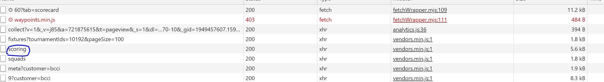
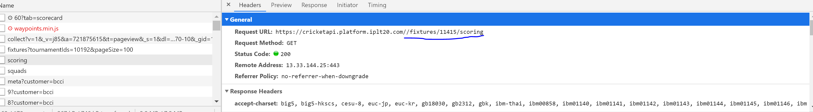

# IPL points scrapper

This python script scraps ipl match scores and applies custom points based on player's performances.

## Steps to setup

1. Clone the repo
2. install require packages needed for the code by running pip install -r requirements.txt
3. setup .env file in root folder with variables mentioned in env_template.txt file.
4. Run `python playerDetailsScrapper.py` - This will fetch the players list and map them to their respective identities.After this step, the `players.csv` and `teams.csv` will be populated with their respective content.
5. Run `python dataScrapper.py`.Make sure all these match IDs are available.
6. Copy content from sample.json and paste in Data/playerPoints.json file.
7. Run `python final_team_points.py` - This will fetch all auction team points.
 

## How to get a match ID

1. Go to `https://www.iplt20.com/matches/results/men/<replace-with-the-ipl-season-year>`. You should see the recent matches with their results.Open developer tools in your browser (Click on F12) and go to the networks tab. 
2. Click on the `Match Centre` option for a match.
3. By now you should see such a request in the networks tab

</img>

4. Clicking on the request should give you the match id that you are looking for.If you know multiple of such consecutive matchIds, you can pass the start and end id as an input to the script.This will fetch details of all the matches in the given range

</img>

5. Once you have completed all of these you should see the entire data populated in the `./Data/playerPoints.json` file.This can be used in any other web client(your own custom app) to showcase the results.
